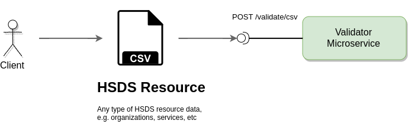
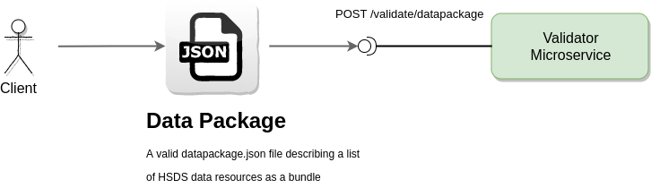
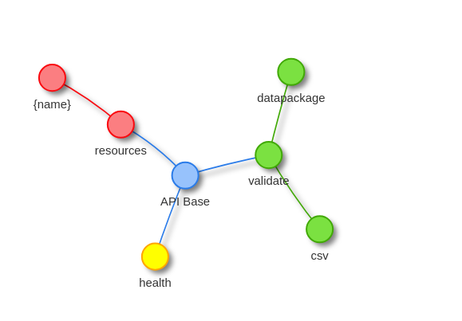
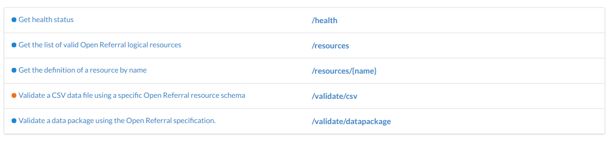

---
# Feel free to add content and custom Front Matter to this file.
# To modify the layout, see https://jekyllrb.com/docs/themes/#overriding-theme-defaults

layout: default
title: Open Referral Validator
---


<div class="container">

    <section class="header">

      <h2 class="title"><span class="brand color">Open Referral</span> HSDS Validator.</h2>

      <h4>A microservice for validating <a href="https://openreferral.org" target="_blank">Open Referral</a> HSDS data packages and resources.</h4>

      <a class="button button-primary" href="#introduction">Get started</a>
      <a class="button" href="{{ site.github }}" target="_blank"><i class="fab fa-github"></i> Github Project</a>

      <div class="value-props row">
        <div class="four columns value-prop">
          
          Validation of data resources according to the <a href="http://docs.openreferral.org/en/latest/" target="_blank">Human Services Data Specifications</a>.
        </div>
        <div class="four columns value-prop">
        <span style="font-size: 72px; color: Dodgerblue; display: block;" >
          <i class="fab fa-docker"></i>
        </span>
          A ready to use Docker image that can be plugged into
          any infrastructure.
        </div>
        <div class="four columns value-prop">
          
          A RESTful API with an Open API definition for
          integration with other services.
        </div>
      </div>
    </section>

</div>


<div class="container">


<div class="docs-section"  markdown="1">

# Table of contents

* [Introduction](#introduction)
* [Running the service](#running)
* [Using the service](#using)
* [API definition](#api)
* [Sample data sets](#sample-data)

</div>


<div class="docs-section"  markdown="1">

## Introduction

The **Human Services Data Specification (HSDS)** is the technical
name for Open Referral's core data exchange format. HSDS is designed to support the
publication of open, interoperable community resource directory data.

> HSDS is designed to support bulk exchange of data between different information and > referral systems.
> It is appropriate to use when you want to export a collection of > information about services,the locations
> where they can be accessed, and the organizations that deliver them.


The <span class="brand color">Open Referral</span> HSDS validator is
a self-standing microservice component that was designed for validating
human service data resources that are to be exchanged
between different systems.

The **HSDS** provides some guidelines on how information should be structured
in order to be exported or imported between heterogeneous systems.  These
guidelines are built on top of the [Data Packages](https://frictionlessdata.io/data-packages/){: target="_blank"}
and [Table Schema](https://frictionlessdata.io/specs/table-schema/){: target="_blank"} specifications
which are industry adopted standards.

The <span class="brand color">Open Referral</span> HSDS specication has its own dedicated repository and a
dedicated documentation site.

<a class="button" href="https://github.com/openreferral/specification" target="_blank"><i class="fab fa-github"></i> Github Project</a>
<a class="button" href="http://docs.openreferral.org/en/latest/hsds/" target="_blank"><i class="fas fa-book"></i> HSDS Documentation</a>

</div>


<div class="docs-section"  markdown="1">

## Running the service {#running}

### Getting the Docker image

You need to have [Docker](https://www.docker.com/){:target="_blank"} service installed on your local machine or any other target host.

Once Docker is installed pull the latest pre-built image from the [Docker Hub](https://hub.docker.com/r/openreferral/playground/) registry by running:

```bash
$ docker pull openreferral/validator
```

### Running the service container

After the Docker image is available you can launch a container by running:

```bash
$ docker run -d --network=host --name=openreferral-validator openreferral/validator:latest
```

You can use any name you want, by replacing the **"openreferral-validator"** value with one of your choice.  The container will bind to  **localhost:1400** by default.  You can change the host and port of the container by setting the **HOST** and **PORT** environment variables like so:

```bash
$ docker run -d --network=host -e HOST=localhost -e PORT=1400 --name=openreferral-validator openreferral/validator:latest
```

Once the container is launched, you can stop it and start / restart it on demand like so

```bash
$ docker stop openreferral-validator
$ docker restart openreferral-validator
```

Once the service has been launched you can verify that the API is up by hitting [http://localhost:1400/health](http://localhost:1400/health){:target="_blank"}.  If everything is ok you should get a blank page (or a **200** response).


</div>


<div class="docs-section"  markdown="1">

## Using the service {#using}

The validator service can be used in a range of use cases which are described in
the following sections.  

### Validating CSV data resources

A client system can use the validator for validating standalone
HSDS data resource files in CSV format.  The input can be either
in the form of a physical file at some URL or a binary stream.



In this validation mode the validator is
using the resource schemas as defined in the full HSDS specification.

### Validating data packages

In this validation mode the client must provide the location of
a valid **datapackage.json** file that describes an HSDS data resource
list that is treated as a bundle.



The validator will process each defined resource sequentially
and check whether the resource conforms to the specified schema.
There is an extra option that enables the validator to perform
a data integrity check among the related files based on primary vs
foreign key checks.

</div>


<div class="docs-section"  markdown="1">

## API Definition {#api}

The micro-service has an [OpenAPI](https://www.openapis.org/){: target="_blank"} 2.x compliant definition that is automatically generated on startup.  You can find the OpenAPI (Swagger) definition here [http://localhost:1400/swagger](http://localhost:1400/swagger){:target="_blank"}.  You can parse the OpenAPI definition with any popular API tool like [Swagger](https://swagger.io/tools/swagger-ui/), [Postman](https://www.getpostman.com/), etc and start interacting with the service.

The following screenshots have been captured using the [API Spots Chrome extension](https://apispots.github.io/){: target="_blank"} which is a
tool for visualizing and interacting with **Open APIs**.

### API Surface



## API Operations



### `GET /health`

#### Description

Returns a 200 OK response

### `GET /validate/datapackage`

#### Description

Validate an HSDS data package.  The operation requires the URI of valid **datapackage.json** file to be provided as a query parameter.  The service will parse the contents of the data package and try to validate all enlisted resources.

#### Query parameters

- `uri`: A valid local or remote URI of a **datapackage.json** descriptor file.
- `relations`: (optional) A boolean flag indicating whether to enable data relations check through defined foreign keys - default is **false**

#### Response

The operation returns a collection of validation results, one per resource as defined within the data package descriptor.

#### Example call

Given we have a sample datapackage.json file at http://example.com/openreferral/datapackage.json that contains a small subset of resources, we can run the following command to validate the contained resources:

```bash
$ curl 'http://localhost:1400/validate/datapackage?uri=http://example.com/openreferral/datapackage.json'
```

If all data resources are valid, the service will return a response like:

```json
[{
  "valid": true,
  "resource": "organization"
}, {
  "valid": true,
  "resource": "program"
}]
```

In case something is wrong, the response would be something like:

```json
[
    {
        "valid": true,
        "resource": "organization"
    },
    {
        "valid": false,
        "errors": [
            {
                "row": 3,
                "description": "Foreign key \"organization_id\" violation in row 3"
            }
        ],
        "resource": "program"
    }
]
```

### `POST /validate/csv`

#### Description

Validate an HSDS data resource file.  The operation validates an uploaded CSV data stream using the definition of a specified resource as found in the standard Open Referral data packagespecification. Clients should send a form payload containg a **type** field with the name of the HSDS logical resource and a **file** that contains the CSV data stream.

#### Consumes

- multipart/form-data

#### Payload

- `type`: A valid HSDS resource name, e.g. **contact**
- `file`: The CSV file to be validated

#### Example call

```bash
$ curl -F 'type=contact' -F 'file=@/home/chris/contacts.csv' 'http://localhost:1400/validate/csv'
```

A successful validation would return something like:

```json
{
    "valid": true,
    "errors": []
}
```

</div>

<div class="docs-section"  markdown="1">

# Sample data sets {#sample-data}

You can test drive the validator using the official *Open Referral* sample data sets found in the dedicated [Github repository](https://github.com/openreferral/sample-data).  Clone the repository or [download as a ZIP archive](https://github.com/openreferral/sample-data/archive/master.zip) and extract them locally.

</div>


</div>
